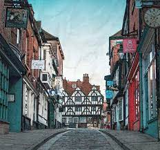

# This is my Second post using the Jekyll framework.
The things that have new to do are:
- Include two images
- Include two links
- Reflect

The things that I struggled with had only to do with filepaths, but those got sorted out with Dr. Goadrich after we found out that GitKraken messed with my Gemfile.
I did use [this](https://www.markdownguide.org/cheat-sheet/) markdown cheat sheet for a refresher on some syntax though.

The things that I don't entirely understand have more to do with [lab 4](https://hendrix-cs.github.io/csci340/labs/jekyllmods.html)
and forking new themes, but I could probably figure that out if I devote more time to it.

I am looking forward to learning how to working on the clients website.

 
 
