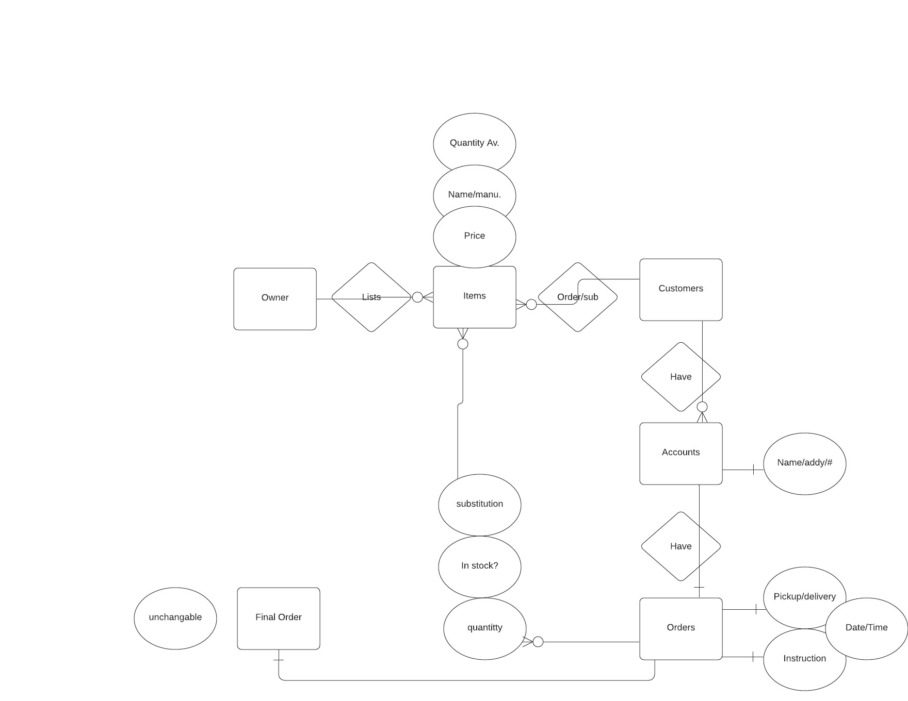

# This is my third post using the Jekyll framework.
The things that have to do are:
- Include my ERD Diagram
- Include my SQL Schema
- Reflect

The things that I struggled with had to do with using SQL, I had a hard time trying to figure out how to connect the tables so I will need to meet with my professor to get another refresher and figure that out, otherwise nothing will work.
I did not have any issues making the ERD though, I am confident that I can make/use the ERD pretty well.

The things that I don't entirely understand have more to do with [lab 5](https://hendrix-cs.github.io/csci340/labs/datamodeling.html)
and SQL/Schemas, but I could probably figure that out if I devote more time to it and learn the commands.

I am looking forward to learning how to work on the client's website.

 
 
